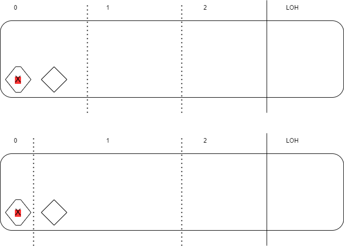

# Interviews Cheat Sheet

Gathered questions and answers from practing to .Net Sr. Software Engineer interviews.

## C#

### Data Structures

1. Array
2. List: inside of it is an array. When it reaches the limit of the array (aka as _capacity_), it gets doubled and the elements are copied to the new location. 
3. Dictionary

### Reference types/value types

1. Value Types: directly contain their data, and each instance of a value type has its own copy of the data. They are typically stored on the stack, which is a region of memory that is faster to allocate and deallocate. Examples of value types in C# include simple types like integers, float,  char, and **custom structs**.

2. Reference Types: store a reference to the memory location where the actual data is held. They don't contain the data directly and are typically stored on the heap, which is a region of memory that is more flexible but slower to allocate and deallocate. Examples of reference types in C# include classes, interfaces, **arrays**, and **strings**.

Some quick answers:
* Structs can not have a reference type on its fields.
* Strings are immutable, meaning their values cannot be changed after they are created. When you modify a string, you are actually creating a new string instance rather than modifying the existing one (that's the reason StringBuilder is better, as it uses a resizable buffer). String literals are stored in a special area of memory known as the intern pool. 
* On methods, if you do not use the **ref** keyword on the signature and it is a value type, you will pass a copy of the value. Reference types are always being passed as references.

```
// Passing by value
void ModifyValue(int num) 
{
    num = 20; // Changes inside the method do not affect the original value
}

// Passing by reference
void ModifyReferenceType(ref int[] array) 
{
    array[0] = 42; // Changes inside the method affect the original array
}
```

### Memory management

There are three topics on this section: heaps, stack and garbage collector.  To check for memory usage, one may use [memory usage](https://learn.microsoft.com/en-us/visualstudio/profiling/memory-usage?view=vs-2022) or [performance profiler](https://learn.microsoft.com/en-us/visualstudio/profiling/profiling-feature-tour?view=vs-2022#post_mortem) (both in Visual Studio). 

1. **Heaps**

It divides the heap into three segments: 0, 1 and 2 (the last one is splitted into two pieces). It organizes it into two pieces: SOH (small object heap) and LOH (large object heap):
* Large Object Heap: things that dont change (constants, static objects, etc) and objects larger than 85KB. Consists of the second piece of segment 2.
* Small Object Heap: consists of segment 0, 1 and the first piece of 2. Generally, developers only write into the 0 segment.

The segments work as a way for the Garbage Collector (GC) to clean up things. For example:
* If asked to clean up 0, 0 is going to be cleaned up
* If asked to clean up 1, 0 **and** 1 are going to be cleaned up
* If asked to clean up 2, all will be cleaned up (including LOH).

Note that objects that have a reference to itself are not going to be cleaned up.

For a object to be allocated on segment 1, GC must have ran and a reference to the objects should exist. That tells GC "this object is a little relevant" and what happens is that it updates the boundary from segment 1 to include those objects. Check the following image.

<p align="center">
  
</p>

If GC runs a compact strategy, it may happen it could compact segment 1, move the objects to a location where it could narrow and make the segment 1 space smaller.

For an object to be allocated on second generation segment, GC must run again and notice the object on segment 1 is still relevant and can be moved to the second one.

Developers should avoid objects to be allocated on the segment 2 for aiming for optimization. According to this [video](https://www.youtube.com/watch?v=TnDRzHZbOio), the accessing time is not the issue. The problem is with memory allocation. Allocating things in LOH costs much more than allocating in SOH. Another tip from the video is that allocating bigger objects less times is better than allocating smaller objects more time.

Challenge: write a program that adds many class to the list. Check if what makes it being moved to LOH is the size of the list (which are references to the object) or the size of the objects summed up. Check if what is moved to LOH is only the list or also the objects.


2. **Garbage collector and Dispose**:

GC works only on managed resources'; i.e. resources that are controlled by the CLR. Unmanaged resources are e.g. file handles, network connections, database connections. 

#### Managed resources

There are two modes:
* Sweep/mark: flips a bit on the object that says the memory can be occupied by something else.
* Compact: remove the objects and compact the remaining ones.

GC runs on a separate thread from the program, so the program doesnt get halted for it's execution. There is a configuration for the GC that one may change: telling the GC it's running on a workstation or on a server. If it's on a server, it's presumed the server has enough resources to the GC to run more frequently, so it won't make the program performance slower. Anyway, normally the automatic settings work ok.

#### Unmanaged resources

Differences between Finalize and Dispose and GC:
* Finalize is called by GC, so it's a last time to release resources.
* Dispose is called by developer, so it reclaims space before GC runs. Normally by using the **using** block, or by expliciting calling the Dispose method.

The best practice is to implement the IDisposable interface on classes that handle unmanaged resources, since dealing with unmanaged resources is a developer responsability (and not doing that can potentially lead to memory leaks). In addition to that, developers normally use the Finalize (aka destructor) to dispose the unmanaged resources in case the developer forgot to call the Dispose previously.

Example with the Dispose Pattern applied: 

```
public class MixedClass : IDisposable
{
    private StreamWriter _writer; // managed resource
    private Excel.Application _excel; // unmanaged resource
    private bool disposedValue;

    public void Initialize()
    {
      _writer = new StreamWriter("output_file.txt");
      _excel = new Excel.Application();
    }

    [SupportedOSPlatform("windows")]
    protected virtual void Dispose(bool disposing)
    {
        if (!disposedValue)
        {
            if (disposing)
            {
                _writer?.Dispose();
                Console.WriteLine("Disposing of writer");
            }
			
            if(_excel != null)
            {
                _excel.Quit();
                Marshal.ReleaseComObject(_excel);
                Console.WriteLine("Releasing Excel");
            }
			
            disposedValue = true;
        }
    }

    // // TODO: override finalizer only if 'Dispose(bool disposing)' has code to free unmanaged resources
    [SupportedOSPlatform("windows")]
    ~MixedClass()
    {
        // Do not change this code. Put cleanup code in 'Dispose(bool disposing)' method
        Dispose(disposing: false);
    }
    [SupportedOSPlatform("windows")]
    public void Dispose()
    {
        // Do not change this code. Put cleanup code in 'Dispose(bool disposing)' method
		    Dispose(disposing: true);
        GC.SuppressFinalize(this);
    }
}
```

### Locks

There are some lock types in C#. Here we will cover lock (monitor), mutex and semaphore/slimsemaphore.

1. **Lock keyword/monitor**: creates a basic code zone where only one thread can enter at the same time. This is precisely the same as using Monitor.Enter/Exit class. One can't use the **await** keyword on it and should not work with Tasks on it, as it would probably lead to thread starvation. Both code snippets below are equivalents:
```
lock (x)
{
    // Your code...
}
```
```
object __lockObj = x;
bool __lockWasTaken = false;
try
{
    System.Threading.Monitor.Enter(__lockObj, ref __lockWasTaken);
    // Your code...
}
finally
{
    if (__lockWasTaken) System.Threading.Monitor.Exit(__lockObj);
}
```
2. **Mutex**: can be named and shared between processes and async code (which lock keyword cannot). The mutex is provided by the OS, so a good use case is to share it between two different applications that run on the same machine. Note that there are also local mutexes (it exists on its process) and the way you use may vary from OS to OS.
```
Mutex m = new Mutex(false, "MyMutex");
        
// Try to gain control of the named mutex. If the mutex is 
// controlled by another thread, wait for it to be released.        
Console.WriteLine("Waiting for the Mutex.");
m.WaitOne();

// Keep control of the mutex until the user presses
// ENTER.
Console.WriteLine("This application owns the mutex. " +
    "Press ENTER to release the mutex and exit.");
Console.ReadLine();

m.ReleaseMutex();
```
3. **SemaphoreSlim**: It allows you to fine-tune the number of threads that can enter into the critical zone. It's a good approach for a "lock" that must done in an async manner.
```
using System;
using System.Threading;
using System.Threading.Tasks;

public class Example
{
    private static SemaphoreSlim semaphore;
    // A padding interval to make the output more orderly.
    private static int padding;

    public static void Main()
    {
        // Create the semaphore.
        semaphore = new SemaphoreSlim(0, 3);
        Console.WriteLine("{0} tasks can enter the semaphore.",
                          semaphore.CurrentCount);
        Task[] tasks = new Task[5];

        // Create and start five numbered tasks.
        for (int i = 0; i <= 4; i++)
        {
            tasks[i] = Task.Run(() =>
            {
                // Each task begins by requesting the semaphore.
                Console.WriteLine("Task {0} begins and waits for the semaphore.",
                                  Task.CurrentId);
                
                int semaphoreCount;
                semaphore.Wait();
                try
                {
                    Interlocked.Add(ref padding, 100);

                    Console.WriteLine("Task {0} enters the semaphore.", Task.CurrentId);

                    // The task just sleeps for 1+ seconds.
                    Thread.Sleep(1000 + padding);
                }
                finally {
                    semaphoreCount = semaphore.Release();
                }
                Console.WriteLine("Task {0} releases the semaphore; previous count: {1}.",
                                  Task.CurrentId, semaphoreCount);
            });
        }

        // Wait for half a second, to allow all the tasks to start and block.
        Thread.Sleep(500);

        // Restore the semaphore count to its maximum value.
        Console.Write("Main thread calls Release(3) --> ");
        semaphore.Release(3);
        Console.WriteLine("{0} tasks can enter the semaphore.",
                          semaphore.CurrentCount);
        // Main thread waits for the tasks to complete.
        Task.WaitAll(tasks);

        Console.WriteLine("Main thread exits.");
    }
}
// The example displays output like the following:
//       0 tasks can enter the semaphore.
//       Task 1 begins and waits for the semaphore.
//       Task 5 begins and waits for the semaphore.
//       Task 2 begins and waits for the semaphore.
//       Task 4 begins and waits for the semaphore.
//       Task 3 begins and waits for the semaphore.
//       Main thread calls Release(3) --> 3 tasks can enter the semaphore.
//       Task 4 enters the semaphore.
//       Task 1 enters the semaphore.
//       Task 3 enters the semaphore.
//       Task 4 releases the semaphore; previous count: 0.
//       Task 2 enters the semaphore.
//       Task 1 releases the semaphore; previous count: 0.
//       Task 3 releases the semaphore; previous count: 0.
//       Task 5 enters the semaphore.
//       Task 2 releases the semaphore; previous count: 1.
//       Task 5 releases the semaphore; previous count: 2.
//       Main thread exits.
```


#### Multi threading
.

#### Performance and monitoring tools
.

## .NET

#### Features
* Cross-platform
* Open source
* Lightweight
* High performance

#### ASP .NET
* Kestrel
* Middleware and filters
* Configuration
* Logging
* Dependency Injection: it is the ability of the framework to provide the dependencies that a certain class has. It helps mocking on tests and to follow SOLID patterns, since it's based on dependendy inversion and inversion of container principles.
* Lifetime scopes

#### Ef Core

* Tracking, 
* Lazy vs eager loading, 
* LINQ/Lambda functions
* Transactions
* Migrations and code first

#### Others

* AOT
* Reflection

## SQL

#### Query performance
.

#### Index creation

Clustered vs non-clustered

#### Transactions
.

## Git

#### Rebase
.

#### Merge
.

#### Cherry pick
.

## Software Engineering

#### Design Patterns

**Singleton**: a single instance of a determined class throughout the project.
**Facade**: a "big interface" that normally has several adapters related to a specific task.
**Factory**: a class that can generate other classes. One use case is that a factory is provided some parameters and return an Interface object which may be any object that implement it.
**DDD**: separation of concerns.

#### Quality 

Code quality:
* DRY, KISS, YAGNI, SOLID
* High modular, decoupled code.
* Variable naming.
* Test coverage & test types

Workflow quality:
* Pair programming
* Code review & pull requests
* Feature branches
* Different environments
* CI/CD pipeline
* Scrum/Kanbam
